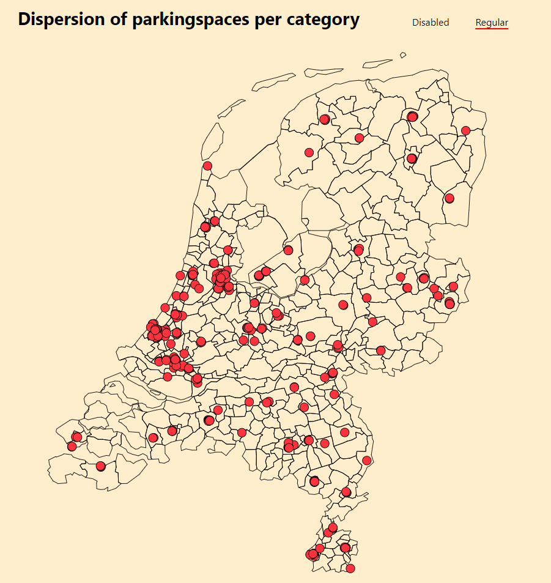

# Map component

## Table of contents
  - [What it does](#what-it-does)
  - [How to use](#how-to-use)
  - [Dependencies](#dependencies)
  - [Developer](#developer)
  - [Changelog](#changelog)

<div style="text-align:center"></div>

## What it does 
* Generate a map chart
* Place dots on specified locations

## How to use
Import and implement component
```js
import Map from '../components/mapchart/Map'

<Map
  id='id'
  title='Title'
  primarySet='https://example.com/dataset.json'
  secondarySet='https://example.com/dataset.json' //optional
  mapData='https://example.com/map.json'
  filterOptions={['option1', 'option2']} //optional
/>
```

## Dependencies
* [D3](https://github.com/d3/d3) - ^6.2.0
* [topojson](https://github.com/topojson/topojson) - ^3.0.2

## Developer
[Shabier](https://www.github.com/sjagoori)

## Changelog
### 1.1
* Added all attributes to the component caller
* Component now works without optional attributes

### 1.0
* Inital component creation