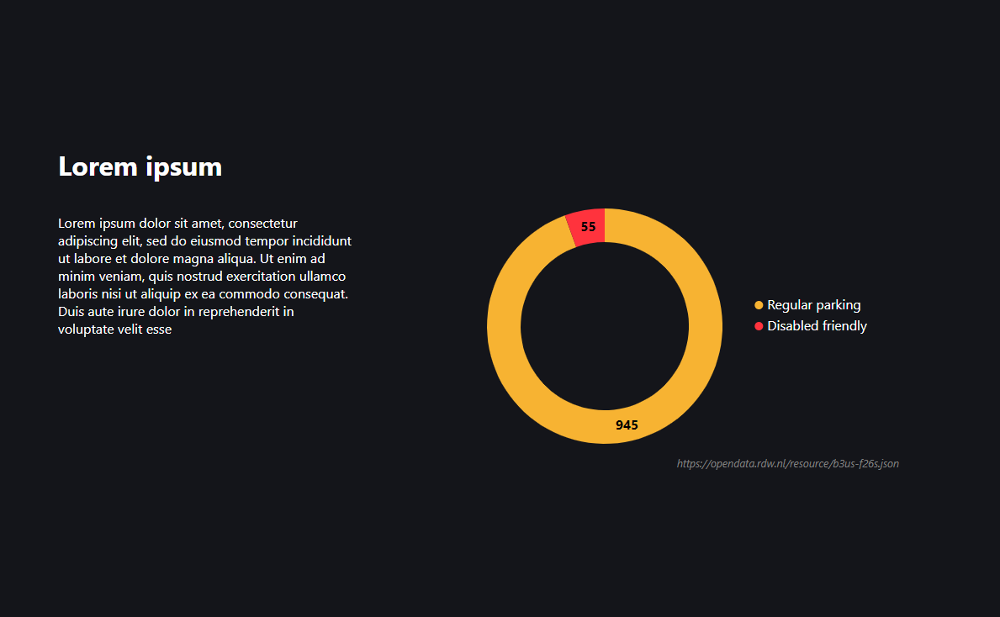

# Piechart component

## Table of contents
  - [What it does](#what-it-does)
  - [How to use](#how-to-use)
  - [Dependencies](#dependencies)
  - [Developer](#developer)
  - [Changelog](#changelog)

<div style="text-align:center"></div>

## What it does 
* Generate a piechart
* Create a legend

## How to use
Import and implement component
```js
import Pie from '../components/piechart/Pie'

<Pie
  id='id'
  title='Lorem ipsum'
  lead='Lorem ipsum dolor sit amet, consectetur adipiscing elit, sed do eiusmod tempor incididunt ut labore et dolore magna aliqua. Ut enim ad minim veniam, quis nostrud exercitation ullamco laboris nisi ut aliquip ex ea commodo consequat. Duis aute irure dolor in reprehenderit in voluptate velit esse'
  primarySet='https://example.com/dataset.json'
/>
```

## Dependencies
* [D3](https://github.com/d3/d3) - ^6.2.0

## Developer
[Shabier](https://www.github.com/sjagoori)

## Changelog
### 1.3
* Added caching for API calls

### 1.2
* Reorded elements, title shows above lead and chart

### 1.1
* Added lead element

### 1.0
* Inital component creation